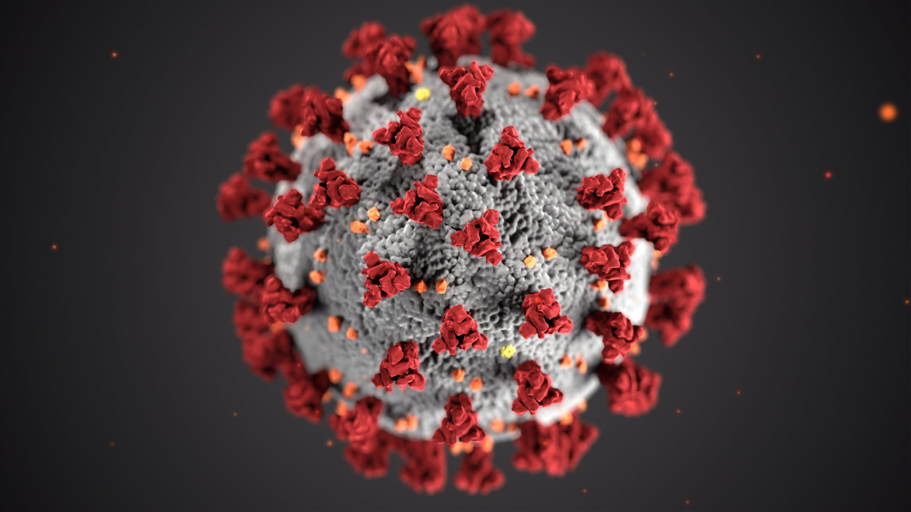
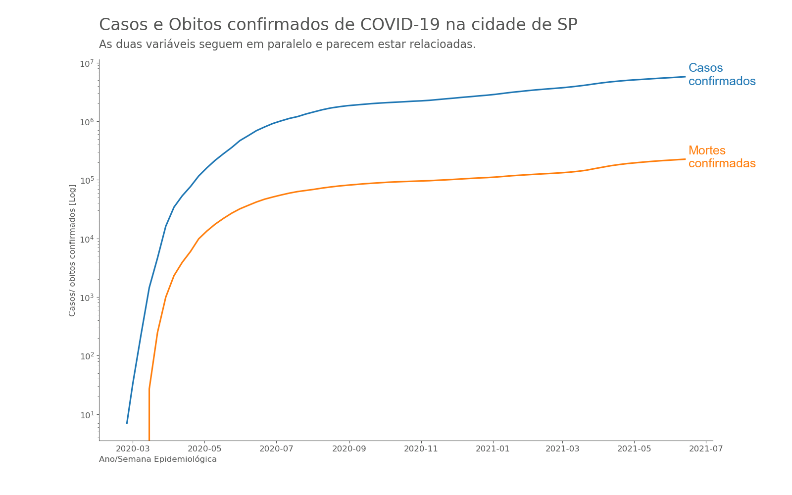
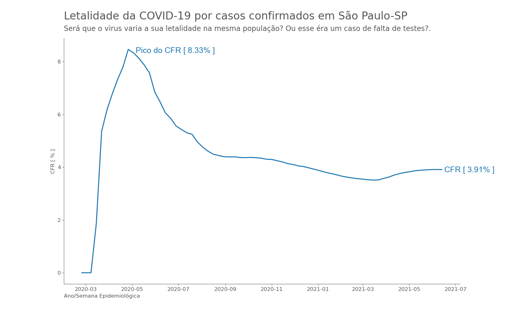

<h1>Taxa de letalidade da <b>COVID-19</b> por casos confirmados </h1>

    
Filipi Rigui - Engenheiro de Controle e Automação

       
    

 

Notebook com a análise exploratória: [**Análise da CFR em São Paulo**](../notebooks/reports/nb_suporte-2.ipynb)

Você já se perguntou qual é a chance de uma pessoa vir a óbito devido a complicações da <b>COVID-19</b>? De líderes políticos até curiosos no cafezinho, saber a resposta a essa pergunta pode ajudar na conscientização e enfrentamento dessa pandemia. 
Esse artigo vai abordar cuidados que se precisam ter ao avaliar os indicadores mais comuns para se descrever <i>letalidade</i> do <b>COVID-19</b>, além de provocar o leitor a refletir e filtrar as informações que lhes são apresentadas no seu dia a dia. 
Para tal, pretendo utilizar os dados da cidade de sâo Paulo, Se necessário, pretendo utilizar outras cidades para futuras comparações. 

<h2>Número de <i>Casos</i> e <i> Mortes</i> confirmados</h2>

Os dois indicadores que são comumente utilizados para se estimar a taxa de mortalidade pelo COVID-19 são: <b>Número de casos confirmados</b> e <b>número de óbitos por covid-19</b>. Vamos ver graficamente como essas duas variáveis se comportam ao longo do tempo. 

É possível observar que os dados têm formas similares e aumentam na medida que o tempo passa. Isso pode nos levar a crer que dividir o <i>número de casos confirmados</i> pelo <i>número de óbitos por <b>covid-19</b></i> resulta no <i>risco de se morrer ao contrair <b>COVID-19</b></i>. Será que esse método, também conhecido com <i>CFR</i>, consegue isolar a taxa de letalidade do <b>COVID-19</b> de fatores externos? Vamos responder essa pergunta a seguir. 

<h2>CFR (Taxa de Letalidade - Case Fatality Risk)</h2>

 O <i>CFR</i> é um teste relativamente barato para ser feito, uma vez que as variáveis que compõe o fator são de domínio público e de facil acesso. Normalmente o <i>CFR</i> é trazido a tona quando o assunto é relacionado a <i>taxa de letalidade do <b>COVID-19</b></i>, mas diferente do que se possa induzir, o <i>CFR <b>não</b> mostra a chance de que uma pessoa venha a óbito ao se contrair <b>COVID-19</b></i>. Parece contraditório, mas o <i>CFR</i> é completamente dependente do contexto e do tempo, e eu vou justificar essa ideia a seguir, começando com a formula para esse indicador, que apesar de simples vai mostrar a relação de proporção entre os óbitos e os casos confirmados. 

$$Case Fatality Rate (CFR) = \frac{\text{Obitos confirmados de COVID-19}}{\text{Casos confirmados de COVID-19}}\times 100$$

Com esse indicador em mente, proponho explanar sobre cada variável independente e depois falar do CFR em si. 

<h2>Casos confirmados de <b>COVID-19</b></h2>

    Usar o indicador de <i>casos confirmados</i> por si só é um problema, uma vez que sabemos que a grande maioria dos infectados são assintomáticos e nem chegam a serem testados. Esse problema faz com que o resultado seja impactado negativamente, trazendo um fator de letalidade maior que o real.  
Quando medimos os casos confirmados, nas entrelinhas, também estamos medindo uma série de outros fatores que estão embutidos no número de casos confirmados e podem trazer erro para o resultado. 

<h3>Vontade Política</h3>

Um governo negacionista pode tomar medidas públicas que dificultam a testagem em massa da população, sem campanhas de testagem, sem publicidade sobre a importância da mesma e sem incentivo financeiro para aqueles setores que viabilizam a fabricação, transporte e execução da testagem em massa. Quando uma região governada por uma cúpula negacionista é comparada com outra região onde o departamento público e privado se preocupa e investe em testagem, teremos uma diferença grande em casos confirmados de COVID-19 per capta entre essas regiões, não necessariamente porque o vírus é mais letal em uma região que em outra e sim pelo simples fato de se testar mais em um local que em outro. 

<h3>Condição financeira</h3>

Existem locais onde o poder público faz todo o esforço para conscientizar e testar a população, e mesmo assim, por falta de recursos, o estado não consegue arcar com a quantidade de testes necessários para uma ampla testagem da população. Normalmente os moradores dessas regiões também carecem de recursos financeiros, fazendo com que a procura por testagem particulares também não seja suficiente para se ter uma boa ideia da real situação da população daquela região. 

<h3>Localidade</h3>

Existem regiões remotas e de difícil acesso. Essas regiões já enfrentam problemas como falta de médicos e medicamentos e em decorrência disso, essas regiões também são afetadas por falta de testes ou de profissionais de saúde responsáveis pela execução dos testes. 

<h2>Óbitos confirmados de <b>COVID-19</b></h2>

Assim como o número de casos confirmados por <b>COVID-19</b>, o número de óbitos também pode ser influenciado por fatores externos, que não entram na conta, mas que podem mudar o resultado geral da letalidade da <b>COVID-19</b>. Os problemas relacionados a medida de óbitos confirmados são maiores quando tentamos relacionar duas ou mais regiões, mais nós vamos tratar esse assunto num tópico posterior. Vamos considerar algumas fontes de erro relacionadas ao indicador de óbitos confirmados a seguir: 

<h3>Urbanização</h3>

Como a urbanização poderia influenciar na quantidade de óbitos?  
    O vírus da <b>COVID-19</b> é transmitido via oral-oral, o que significa que quanto mais próximas as pessoas estão, maior a chance de se ter mais transmissão, e em decorrência, maior a quantidade de óbitos. Uma cidade populosa e urbanizada normalmente tem complexos habitacionais, transporte público, atividades de recreio coletivo, como teatros, cinemas etc., e tudo isso, apesar de ser ótimo para a sociedade, favorece a transmissão do vírus. De outro modo, uma região que tem a mesma quantidade de pessoas, mais que é em zona rural, onde cada família mora em um lote maior, cada família tem seu meio de locomoção próprio, vai fazer com que o vírus não se propague na mesma proporção, e consequentemente, vai gerar um número de mortes menos. 

<h3>Idade e comorbidades</h3>

Assim como na questão da urbanização, uma região específica, que não tenha em sua população a representação da população média, vai ter indicadores distorcidos da letalidade da <b>COVID-19</b>. 
Como assim? Uma região que tenha uma idade média elevada, e em decorrência da idade um número maior de pessoas com comorbidades, vai trazer para o resultado um valor de letalidade maior do que a letalidade real. O contrário acontece em uma região onde a idade média das pessoas é muito mais baixa que a média. 

<h2><i>CFR</i> do <b>COVID-19</b></h2>

Depois de considerar as variáveis (caos e óbitos confirmados) individualmente, nós precisamos fazer a equação da <i>CFR</i> e entender o que é que esse indicador nos mostra e como nós podemos utilizá-lo ao nosso favor para o enfrentamento correto da pandemia. 

<h3>Pessoas que vão falecer, mais ainda são somente casos confirmados</h3>

O <i>CFR</i> considera como casos confirmados, pessoas que vão chegar a morrer no futuro.
Imagine que uma determinada região tenha hoje 1000 casos e 50 mortos. Quantas pessoas que fazem parte das 1000, que foram consideradas "somente" como casos confirmados vão ter complicações e morrer nos proximos dias, fruto da <b>COVID-19</b>? Esse erro também está imbutido nesse indicador, atrapalhando a estimativa

<h3>Baixa testagem no inicio</h3>

No início de uma epidemia, normalmente leva-se um tempo até que a região esteja preparada para testar a presença da doença. Isso faz gerar um déficit de casos para o número de mortos.  
Se indevidamente nós utilizarmos os valores gerais, da quantidade total de casos por total de óbitos confirmados, nós vamos "carregar" esse erro inicial para o resultado final, mas nós vemos uma certa estabilidade após outubro 2020, então parece razoável utilizar os resultados a partir daí. 

<h3>Comparação entre regiões</h3>

Dado as características socioeconômicas, regionais e populacionais, e os erros relacionados com essas características, não é recomendado a comparação entre regiões distintas de <i>CFR</i>, a não ser em casos muito bem estudados onde pode-se atribuir uma razoável igualdade desses fatores entre as regiões avaliadas. 

<h3>Histórico da mesma região</h3>

Desde que tomadas as devidas precauções, fazendo uma avaliação histórica da mesma região e desconsiderando os meses iniciais, é possível utilizar o <i>CFR</i>. Isso porque as condições socioeconômicas, regionais e populacionais da mesma região não devem sofrer alterações abruptas ao longo do tempo.  
O agente da pesquisa precisa ter em mente que o objetivo não pode ser estimar a chance de que uma pessoa venha a óbito após contrair <b>COVID-19</b>, e sim um acompanhamento da relação entre os casos e óbitos confirmados a fim de detectar algum tipo de mudança que valha a pena ser investigada mais detalhadamente. 

<h2>IFR (Taxa de letalidade por infecção)</h2>

O indicador de <i>Taxa de letalidade por infecção</i> é um indicador bem mais preciso, pois visa considerar a todos os casos, não somente os confirmados, porém, ao contrário do <i>CFR</i>, o <i>IFR</i> é um indicador muito mais difícil e caro para se conseguir, pois precisa-se utilizar de amostragem e fazer um controle de um grupo populacional com exames periódicos para monitorar quantos desse grupo de fato contrai a <b>COVID-19</b> e então encontrar a letalidade do virus. 

<h2>Conclusão</h2>

Vimos que o indicador chamado <i>CFR</i> não é um indicador apropriado para definirmos com precisão qual é a letalidade da <b>COVID-19</b>, porém é um teste barato, de facil acesso, e que permite uma idéia do cenário geral ou se existe algo mudando na relação entre o número de contágio confirmado peo número de obito confirmado. Esse indice é muito dependente do contexto que está sendo avaliado, não sendo recomendada a comparação entre os indicadores para se saber se em algum lugar a <b>COVID-19</b> é mais letal que outro. 
Como considerações finais, eu gostaria de incentiver o leitor a se questionar sobre aquilo que está avaliando. Existe alguma influência externa que pode mascarar a informação que temos na mão? Por mais bem feito que esteja um gráfico, o valor da linha/ barra, ponto, faz sentido com a realidade? 
Pense sempre no erro de medição como algo que vai existir, mais que precisa ser conhecido e controlado para que se tenha sucesso naquilo que se pretende avaliar.

## Referência Bibliográfica

[Mortality Risk of COVID-19](https://ourworldindata.org/mortality-risk-covid) 
[Que é taxa de fatalidade de caso (CFR)?](https://www.news-medical.net/health/What-is-Case-Fatality-Rate-(CFR)-(Portuguese).aspx) 
[Coronavirus (COVID-19) Mortality Rate](https://www.worldometers.info/coronavirus/coronavirus-death-rate/) 
[Estimating mortality from COVID-19](https://www.who.int/news-room/commentaries/detail/estimating-mortality-from-covid-19) 

